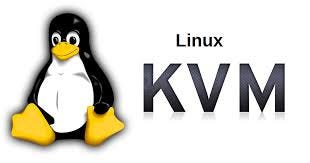
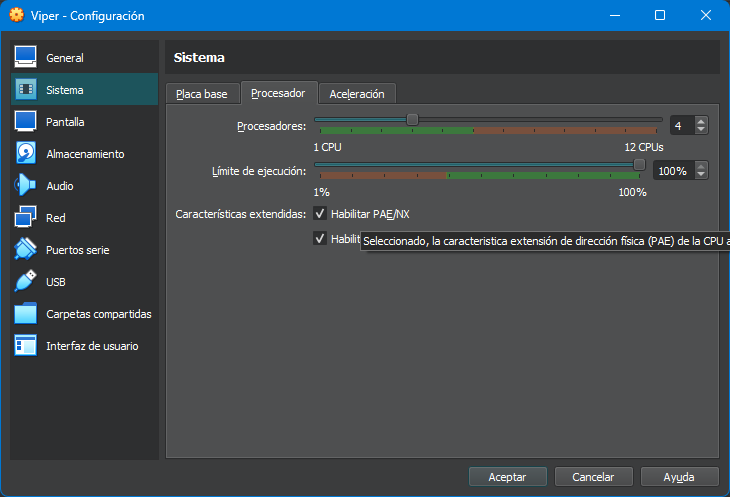
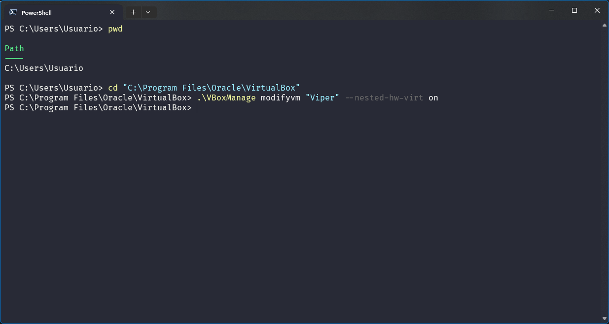
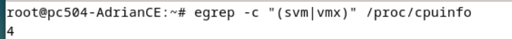

# Instalación-KVM

<p align="center">
    
</p>

Instalación de KVM en maquina virtualizada , vamos a utilizar la maquina preparada , puedes consultar como preparar la maquina en el siguiente enlace:

<div align="center">
 <a href="https://github.com/AdrianCE94/maquinaDebian12" target="_blank">Repositorio máquinaDebian12</a>

</div>


# Índice
- [1. ¿Qué es KVM?](#1-qué-es-kvm)
- [2. Ventajas de KVM e inconvenientes](#2-ventajas-de-kvm-e-inconvenientes)
- [3. qemu, libvirt, libvirtd, virsh y virt-manager](#3-qemu-libvirt-libvirtd-virsh-y-virt-manager)
- [4. Requirements Hardware \& Software](#4-requirements-hardware--software)
- [5. Instalación de KVM en Debian 12](#5-instalación-de-kvm-en-debian-12)
    - [5.1 Preparando el entorno de trabajo](#51-preparando-el-entorno-de-trabajo)
---
# 1. ¿Qué es KVM?

KVM (Kernel Virtual Machine) es una arquitectura de virtualización complet de software libre.

Se presenta como una alternativa a sistemas de virtualización propietarios como Hyper-V y VMware. 

KVM tiene dos componentes esenciales que son:
- **El módulo del kernel kvm.ko** que proporciona la infraestructura de virtualización del núcleo.
- **QEMU** que proporciona la emulación de hardware.

# 2. Ventajas de KVM e inconvenientes

| **Ventajas**                   | **Inconvenientes**              |
|--------------------------------|---------------------------------|
| Es software libre.             | Puede requerir conocimientos técnicos avanzados. |
| Mejora la eficiencia.          | Compatibilidad|
| Flexibilidad                   | Dependencia de hardware compatible. |
| Escalabilidad                  | Puede haber problemas de rendimiento en entornos muy grandes. |
| Seguridad                      | Necesidad de actualizaciones y mantenimiento regulares. |
| Facilidad de uso               | La documentación puede ser escasa o difícil de seguir. |

# 3. qemu, libvirt, libvirtd, virsh y virt-manager

- **QEMU** es un emulador de hardware y virtualizador de máquinas. Es el encargado de emular el hardware de la máquina virtual.
- **libvirt** es un toolkit para gestionar plataformas de virtualización 
- **libvirtd** es un demonio que actúa como servidor de libvirt.
- **virsh** es una interfaz de línea de comandos para gestionar máquinas virtuales.1
- **virt-manager** es una interfaz gráfica para gestionar máquinas virtuales.


# 4. Requirements Hardware & Software

- **Hardware**:
  - Procesador con soporte de virtualización (Intel VT-x o AMD-V).
  - 2 GB de RAM.
  - Disco suficiente para la instalación de los sistemas operativos.

- **Software**:
  - **Sistema operativo** Linux con el modulo KVM cargado.
  - **QEMU** instalado.
  - **libvirt y libvirtd** instalado.

# 5. Instalación de KVM en Debian 12	

Antes de instalar KVM, es necesario comprobar si el procesador soporta la virtualización. Para ello, como mi maquina anfitriona es un windows 11, voy a trabajar sobre un debian12 virtualizado (puedes consultar como preparar la maquina en el siguiente enlace:  <a href="https://github.com/AdrianCE94/maquinaDebian12" target="_blank">Repositorio máquinaDebian12</a>)

---

### 5.1 Preparando el entorno de trabajo
Activamos la virtualizacion anidada y PAE/NX en la maquina virtualizada, para ello : abrir la configuración de la maquina virtualizada, seleccionar la pestaña de procesador y activar la casilla de virtualizacion anidada y PAE/NX.



**NOTA IMPORTANTE**: Si NO deja activar la virtualización anidada , tenemos que ir a nuestra maquina anfitriona y habilitarlo por comandos.

WINDOWS:

```POWERSHELL
cd "C:\Program Files\Oracle\VirtualBox"
VBoxManage modifyvm "Nombre de tu máquina" --nested-hw-virt on
```



LINUX: sobre la terminal de la máquina anfitriona
```bash
VBoxManage modifyvm "Nombre de tu máquina" --nested-hw-virt on
``` 
Buscar cuántas CPUs tenemos que soporten virtualización (El procesador tiene que tener más de un núcleo):
ejecutar en maquina virtualizada en mi caso o sobre linux en la maquina anfitriona
(como root)
```bash
egrep -c '(vmx|svm)' /proc/cpuinfo
```


