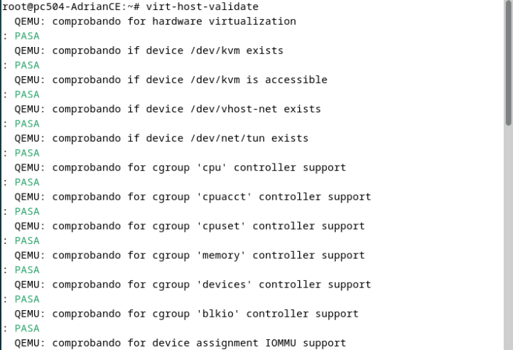

# Instalación-KVM

<p align="center">
    
</p>

Instalación de KVM en maquina virtualizada , vamos a utilizar la maquina preparada , puedes consultar como preparar la maquina en el siguiente enlace:

<div align="center">
 <a href="https://github.com/AdrianCE94/maquinaDebian12" target="_blank">Repositorio máquinaDebian12</a>

</div>
También puedes descargar directamente la máquinaa: (contraseña root : peque)
<div align="center">
 <a href="https://drive.google.com/file/d/1sIQKebnwafYNS-PbIBlXLz3HqbJ7Tvp0/view?usp=sharing" target="_blank">Dowload OVA</a>
</div>
 si descargas la ova tiene una configuracion estatica , ajustar el archivo /etc/network/interfaces a tu rango de ip. 

# Índice
- [Instalación-KVM](#instalación-kvm)
- [Índice](#índice)
- [1. ¿Qué es KVM?](#1-qué-es-kvm)
- [2. Ventajas de KVM e inconvenientes](#2-ventajas-de-kvm-e-inconvenientes)
- [3. qemu, libvirt, libvirtd, virsh y virt-manager](#3-qemu-libvirt-libvirtd-virsh-y-virt-manager)
- [4. Requirements Hardware \& Software](#4-requirements-hardware--software)
- [5. Instalación de KVM en Debian 12](#5-instalación-de-kvm-en-debian-12)
    - [5.1 Preparando el entorno de trabajo](#51-preparando-el-entorno-de-trabajo)
    - [5.2  Comando  para instalar KVM](#52--comando--para-instalar-kvm)
- [7.-Agregar nuestro usuario al grupo de administradores de KVM](#7-agregar-nuestro-usuario-al-grupo-de-administradores-de-kvm)
- [8.Validación](#8validación)
---
# 1. ¿Qué es KVM?

KVM (Kernel Virtual Machine) es una arquitectura de virtualización completa de software libre.

Se presenta como una alternativa a sistemas de virtualización propietarios como Hyper-V y VMware. 

KVM tiene dos componentes esenciales que son:
- **El módulo del kernel kvm.ko** que proporciona la infraestructura de virtualización del núcleo.
- **QEMU** que proporciona la emulación de hardware.

# 2. Ventajas de KVM e inconvenientes

| **Ventajas**                   | **Inconvenientes**              |
|--------------------------------|---------------------------------|
| Es software libre.             | Puede requerir conocimientos técnicos avanzados. |
| Mejora la eficiencia.          | Compatibilidad|
| Flexibilidad                   | Dependencia de hardware compatible. |
| Escalabilidad                  | Puede haber problemas de rendimiento en entornos muy grandes. |
| Seguridad                      | Necesidad de actualizaciones y mantenimiento regulares. |
| Facilidad de uso               | La documentación puede ser escasa o difícil de seguir. |

# 3. qemu, libvirt, libvirtd, virsh y virt-manager

- **QEMU** es un emulador de hardware y virtualizador de máquinas. Es el encargado de emular el hardware de la máquina virtual.
- **libvirt** es un toolkit para gestionar plataformas de virtualización 
- **libvirtd** es un demonio que actúa como servidor de libvirt.
- **virsh** es una interfaz de línea de comandos para gestionar máquinas virtuales.
- **virt-manager** es una interfaz gráfica para gestionar máquinas virtuales.


# 4. Requirements Hardware & Software

- **Hardware**:
  - Procesador con soporte de virtualización (Intel VT-x o AMD-V).
  - 2 GB de RAM.
  - Disco suficiente para la instalación de los sistemas operativos.

- **Software**:
  - **Sistema operativo** Linux con el modulo KVM cargado.
  - **QEMU** instalado.
  - **libvirt y libvirtd** instalado.

# 5. Instalación de KVM en Debian 12	

Antes de instalar KVM, es necesario comprobar si el procesador soporta la virtualización. Para ello, como mi maquina anfitriona es un windows 11, voy a trabajar sobre un debian12 virtualizado (puedes consultar como preparar la maquina en el siguiente enlace:  <a href="https://github.com/AdrianCE94/maquinaDebian12" target="_blank">Repositorio máquinaDebian12</a>)

---

### 5.1 Preparando el entorno de trabajo
Activamos la virtualizacion anidada y PAE/NX en la maquina virtualizada, para ello : abrir la configuración de la maquina virtualizada, seleccionar la pestaña de procesador y activar la casilla de virtualizacion anidada y PAE/NX.


**NOTA IMPORTANTE**: Si NO deja activar la virtualización anidada , tenemos que ir a nuestra maquina anfitriona y habilitarlo por comandos.


LINUX: sobre la terminal de la máquina anfitriona
```bash
VBoxManage modifyvm "Nombre de tu máquina" --nested-hw-virt on
``` 
Buscar cuántas CPUs tenemos que soporten virtualización (El procesador tiene que tener más de un núcleo):
ejecutar en maquina virtualizada en mi caso o sobre linux en la maquina anfitriona
(como root)
```bash
egrep -c '(vmx|svm)' /proc/cpuinfo
```


### 5.2  Comando  para instalar KVM


```bash	
sudo apt install -y qemu-kvm libvirt-clients libvirt-daemon-system bridge-utils libguestfs-tools genisoimage virtinst libosinfo-bin virt-manager
```	


# Explicación de los paquetes de KVM en Debian 12

A continuación, se describen los paquetes necesarios para instalar y configurar KVM en Debian 12:

## `qemu-kvm`
- **Descripción**: Este es el paquete principal para la virtualización en Linux utilizando KVM (Kernel-based Virtual Machine).
- **Función**: Instala el hipervisor KVM, que permite ejecutar máquinas virtuales sobre el núcleo de Linux.

## `libvirt-clients`
- **Descripción**: Paquete que incluye herramientas cliente para interactuar con el sistema de virtualización `libvirt`.
- **Función**: Proporciona herramientas para gestionar máquinas virtuales, redes y almacenamiento, usando el servicio `libvirt`.

## `libvirt-daemon-system`
- **Descripción**: Este paquete incluye el servicio `libvirt` que actúa como intermediario entre los usuarios y el hipervisor de virtualización.
- **Función**: Proporciona la infraestructura necesaria para administrar las máquinas virtuales, redes y almacenamiento de manera centralizada.

## `bridge-utils`
- **Descripción**: Paquete que contiene herramientas para configurar redes puente en sistemas Linux.
- **Función**: Permite a las máquinas virtuales conectarse a la red física del host mediante un puente de red, facilitando la comunicación con otras máquinas en la misma red.

## `libguestfs-tools`
- **Descripción**: Herramientas para acceder y modificar discos virtuales de máquinas sin necesidad de arrancar el sistema operativo invitado.
- **Función**: Proporciona la capacidad de interactuar con imágenes de máquinas virtuales, como editar archivos o realizar copias de seguridad.

## `genisoimage`
- **Descripción**: Herramienta que permite crear imágenes ISO a partir de archivos y directorios.
- **Función**: Se utiliza para crear imágenes ISO, que pueden ser utilizadas para arrancar y realizar la instalación de sistemas operativos en máquinas virtuales.

## `virtinst`
- **Descripción**: Herramienta de línea de comandos para crear máquinas virtuales en sistemas que usan `libvirt`.
- **Función**: Permite la creación de máquinas virtuales desde la terminal de manera automatizada, especificando recursos como CPU, memoria, disco y archivo ISO para la instalación.

## `libosinfo-bin`
- **Descripción**: Herramientas que permiten obtener información sobre sistemas operativos disponibles para ser utilizados en máquinas virtuales.
- **Función**: Facilita la obtención de información sobre las versiones y configuraciones de sistemas operativos compatibles con las máquinas virtuales.

## `virt-manager`
- **Descripción**: Interfaz gráfica para la gestión de máquinas virtuales.
- **Función**: Ofrece una interfaz visual fácil de usar para crear, configurar y gestionar máquinas virtuales, redes y almacenamiento en sistemas KVM.

---

Hemos instalado el core de KVM y los paquetes necesatrios para realizar bridges.

---

# 6. Comprobaciones

```bash
systemctl start libvirtd
```

```bash
systemctl status libvirtd
```


Si nos encontramos con  errores de kvm de permisos,

editar fichero /etc/libvirt/qemu.conf

```bash
nano /etc/libvirt/qemu.conf
```
CTRL + W y buscar user y group, cambiar el usuario y grupo a root
ALT + W para buscar siguiente
```bash
user = "root"
group = "root"
```


# 7.-Agregar nuestro usuario al grupo de administradores de KVM

```bash
su - 
NombreUsuario
adduser NombreUsuario libvirt
adduser NombreUsuario libvirt-qemu
newgrp libvirt
newgrp libvirt-qemu
```


**_NOTA_**: info sobre virt-manager,
 si queremos manejar MVs con un usuario que no sea root, debe estar añadido al grupo “libvirt”.
```bash
sudo -
NombreUsuario
cat /usr/share/doc/virt-manager/README.Debian
```
**_NOTA_** : Se recomienda instalar ssh para poder manejar las MVs de forma remota.


# 8.Validación

Para comprobar que KVM está instalado y funcionando correctamente, ejecutamos el siguiente comando:

```bash
virt-host-validate
virt-host-validate | grep -i 'FALLA\ADVERTENCIA'
```


si iniciamos en la terminal virt-manager, nos aparecerá la interfaz gráfica de KVM

```bash 
virt-manager
``` 


---

Con esto hemos terminado la instalación de KVM en nuestra máquina virtualizada y hemos comprobado que está funcionando correctamente.A partir de aquí, ya podemos crear máquinas virtuales con KVM.Si quieres saber cómo crear una máquina virtual con KVM o como configurar la red , puedes consultar los siguiente enlaces:
<div align="center">
 <a href="https://github.com/AdrianCE94/Instalacion-KVM"
  target="_blank">Instalar KVM</a>
</div>
<div align="center">
 <a href="https://github.com/AdrianCE94/creacionMV-KVM"
  target="_blank">Crear MV con KVM</a>
</div>


<div align="center">
 <a href="https://github.com/AdrianCE94/RedKVM"
  target="_blank">Configurar Red KVM</a>
</div>


